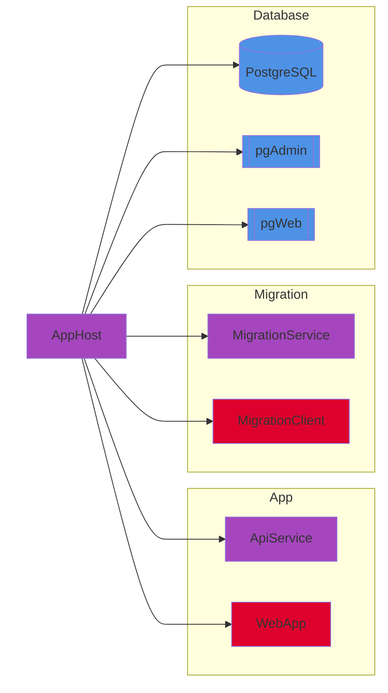
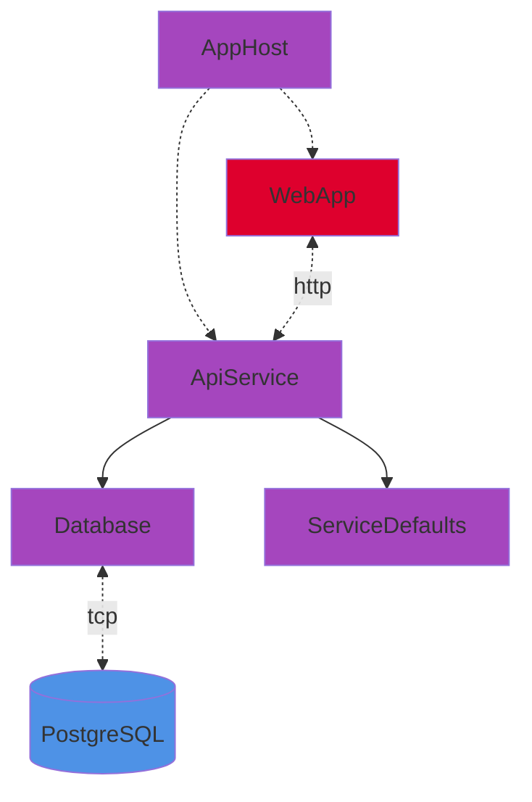
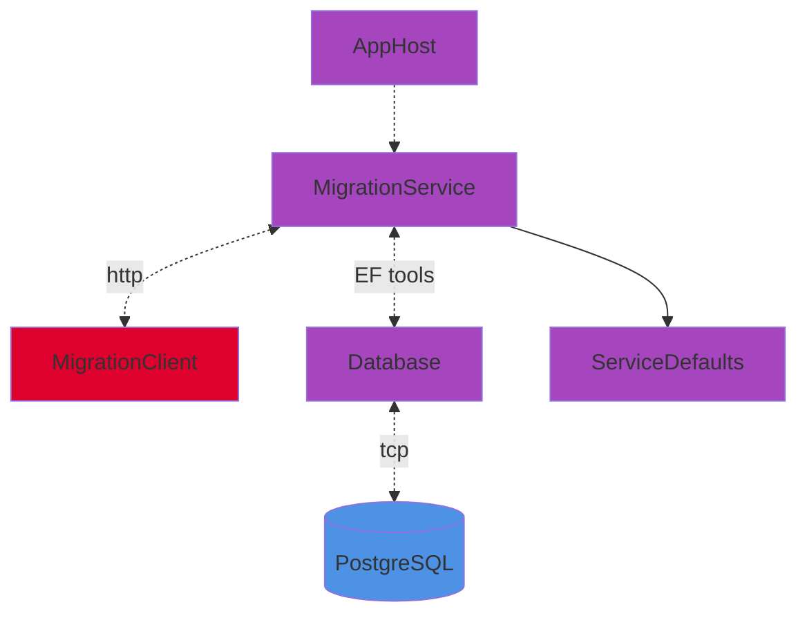

# AppHost

## Run

```bash
dotnet run
```

> [!WARNING]
> Database persistence disabled by default. See [DB_PERSISTENCE](#configuration-variables).

## Modules



## Modes

**Default:** App.

---

- ### App



---

- ### Migration



## Configuration variables

> ### DB_MIGRATION ( bool | false )
>
> - Enables migration mode.
> - Enables database persistence.
> - [EF commands](https://learn.microsoft.com/en-us/ef/core/managing-schemas/migrations/?source=recommendations&tabs=dotnet-core-cli) can be send from MigrationClient.

&#32;

> ### DB_PERSISTENCE ( bool | false )
>
> - Enables database persistence.
> - In [App mode](#app), database must be previously created/updated in [Migration mode](#migration).
