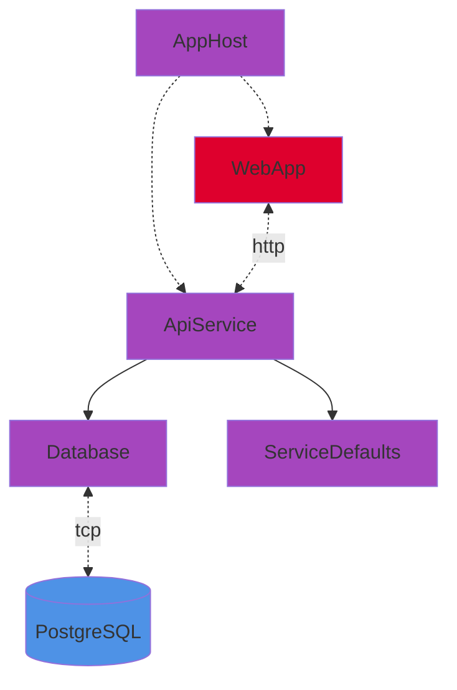
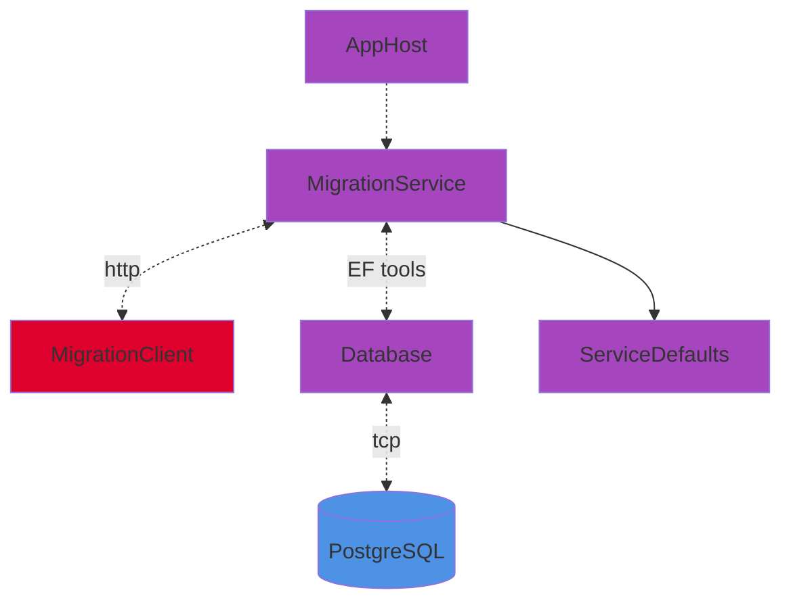

# AppHost

## Run

```bash
dotnet run
```

> [!WARNING]
> Database persistence disabled by default. See [DB_PERSISTENCE](#configuration-variables).

## Modules


## Modes

**Default:** App.

**Base services:** [PostgreSQL](https://www.postgresql.org/), [pgAdmin](https://www.pgadmin.org/) & [pgweb](https://sosedoff.github.io/pgweb/) containers.

---

- ### App

  - The ApiService and WebApp are also started.

&#32;

> [!IMPORTANT]
> If [DB_PERSISTENCE](#configuration-variables) is enabled, database must be previously created/updated in [Migration mode](#migration).



---

- ### Migration

  - MigrationService and MigrationClient are also started to allow management of database schema changes.
  - [EF commands](https://learn.microsoft.com/en-us/ef/core/managing-schemas/migrations/?source=recommendations&tabs=dotnet-core-cli) can be sent from MigrationClient.



## Configuration variables

| Variable           | Type  | Default | Description |
|:------------------:|:-----:|:-------:|-------------|
| **DB_MIGRATION**   | bool  | false   | - Enables [Migration mode](#migration).<br> - Enables database persistence. |
| **DB_PERSISTENCE** | bool  | false   | - Enables database persistence.<br> - If enabled and in [App mode](#app), database must be previously created/updated in [Migration mode](#migration).<br> - If disabled a new database is created each time the app is run, and the data is lost along with the database container. |
