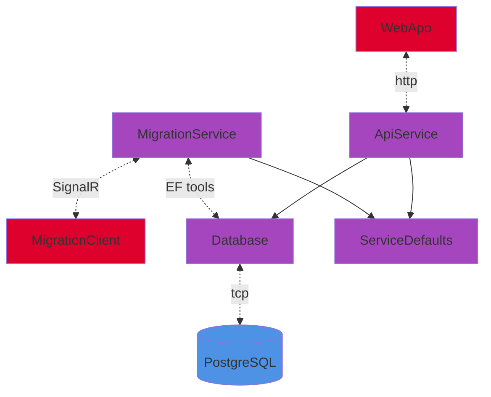

# AstraStock

## Dependencies

- [.NET 8.0 SDK](https://dotnet.microsoft.com/en-us/download/dotnet/8.0)

- .NET Aspire workload:

  ```bash
  dotnet workload update
  dotnet workload install aspire
  ```

- An OCI compliant container runtime, such as:

  - [Docker Desktop](https://www.docker.com/products/docker-desktop)

- [Node.js LTS](https://nodejs.org/)

## Run

See [AppHost](AppHost/README.md).

## Projects

- [AppHost](AppHost/): A host service that acts as the main entry point for running and managing the lifecycle of the application's services and components.

- [WebApp](WebApp/): The user-facing web application that provides the UI.

- [ApiService](ApiService/): A backend API service that provides the core business logic and endpoints for data exchange between the client and server.

- [Database](Database/): The database project responsible for schema definition, database connectivity, and entity mapping.

- [MigrationService](MigrationServiceiService/): A Service managing database schema migrations and updates.

- [MigrationClient](MigrationServiceiService/Client/): This project interacts with the MigrationService to apply necessary schema changes to the Database. It serves as an interface to trigger migrations in Migration Mode.

- [ServiceDefaults](ServiceDefaults/): A shared library containing common server configurations.

- [Shared](Shared/): A library that houses utilities that are shared across multiple projects.

- [Tests](Tests/): Unit, integration, and functional tests.


