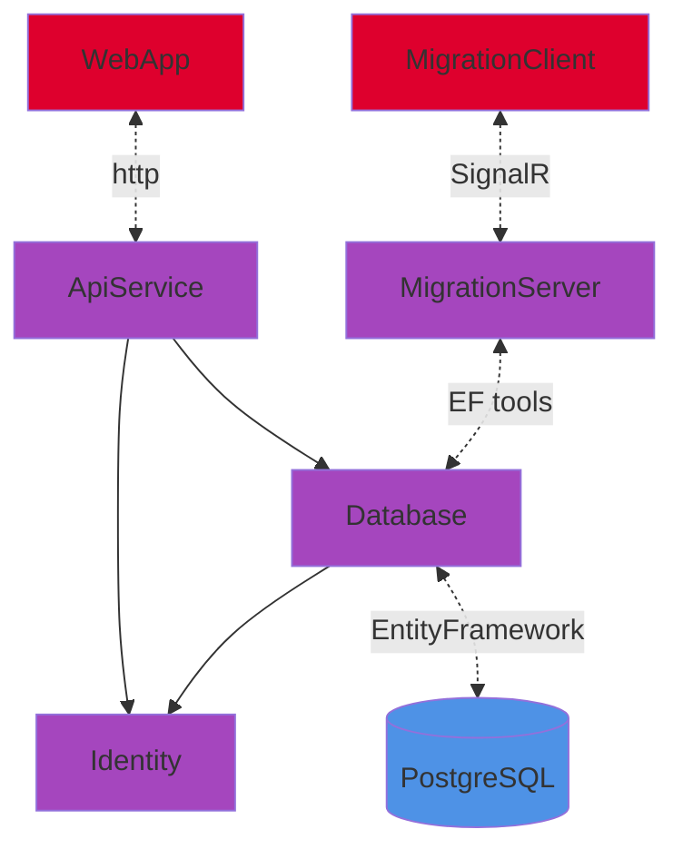

# MrHotel


> [!IMPORTANT]
> Initialize all the submodules.
>
> ```bash
> git submodule update --init --recursive
> ```

## Dependencies

- [.NET 8.0 SDK](https://dotnet.microsoft.com/en-us/download/dotnet/8.0)

- .NET Aspire workload:

  ```bash
  dotnet workload update
  dotnet workload install aspire
  ```

- [Node.js LTS](https://nodejs.org/)

- npm packages:

  ```bash
  npm install -g @angular/cli
  npm install -g @ionic/cli
  ```

- An OCI compliant container runtime, such as:

  - [Docker Desktop](https://www.docker.com/products/docker-desktop)

## Run

See [AppHost](AppHost/README.md).

## Projects

- [AppHost](AppHost/): A host service that acts as the main entry point for running and managing the lifecycle of the application's services and components.

- [ServiceDefaults](ServiceDefaults/): A shared library containing common configurations.

- [WebApp](WebApp/): The user-facing web application that provides the UI.

- [ApiService](ApiService/): A backend API service that provides the core business logic and endpoints for data exchange between the client and server.

  - [Database](Database/): The database project responsible for schema definition, database connectivity, and entity mapping.

  - [Identity](Identity/): A project that handles user authentication, authorization, and identity management. It provides functionality for user registration, login, and role-based access control.

- [Tests](Tests/): Unit, integration, and functional tests.

- [EFMigrationService](https://github.com/RaptorRush135/EFMigrationService/tree/main):

  - [MigrationServer](https://github.com/RaptorRush135/EFMigrationService/tree/main/Server): A Service managing database schema migrations and updates.

  - [MigrationClient](https://github.com/RaptorRush135/EFMigrationService/tree/main/Client): This project interacts with the MigrationServer to apply necessary schema changes to the Database. It serves as an interface to trigger migrations in Migration Mode.


